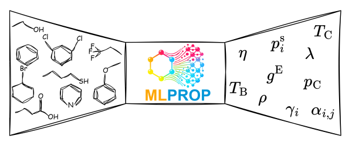

[![Dev][docs-stable-img]][docs-stable-url] [![Dev][docs-dev-img]][docs-dev-url] [![Build Status][build-img]][build-url] [![Paper][paper-img]][paper-url]

  

# MLPROP.jl

This repository contains Julia implementations of MLPROP models integrated with [Clapeyron.jl](https://github.com/ClapeyronThermo/Clapeyron.jl) as the thermodynamic solver library.
An interactive website for MLPROP is available at [https://ml-prop.mv.rptu.de](https://ml-prop.mv.rptu.de).

The documentation for `MLPROP.jl` can be found [here](https://se-schmitt.github.io/MLPROP.jl/stable).

[docs-stable-img]: https://img.shields.io/badge/docs-stable-blue.svg
[docs-stable-url]: https://se-schmitt.github.io/MLPROP.jl/stable

[docs-dev-img]: https://img.shields.io/badge/docs-dev-blue.svg
[docs-dev-url]: https://se-schmitt.github.io/MLPROP.jl/dev

[build-img]: https://github.com/se-schmitt/MLPROP.jl/actions/workflows/CI.yml/badge.svg?branch=main
[build-url]: https://github.com/se-schmitt/MLPROP.jl/actions/workflows/CI.yml?query=branch%3Amain

[paper-img]: https://img.shields.io/badge/paper-general-blue.svg
[paper-url]: https://doi.org/10.1002/cite.70004