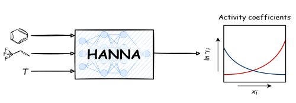
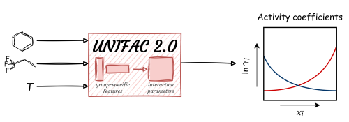
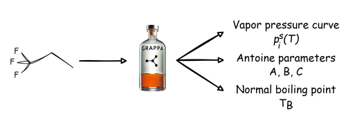
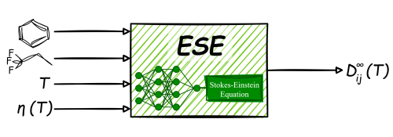

# [Models](@id models_page)

## HANNA models



```@docs
MLPROP.ogHANNA
MLPROP.multHANNA
```

## mod. UNIFAC 2.0 and UNIFAC 2.0



The methods for [UNIFAC 2.0](https://clapeyronthermo.github.io/Clapeyron.jl/stable/eos/activity/#Clapeyron.ogUNIFAC2) and [mod. UNIFAC 2.0](https://clapeyronthermo.github.io/Clapeyron.jl/stable/eos/activity/#Clapeyron.UNIFAC2) are described in the `Clapeyron.jl` documentation.

## GRAPPA



Graph neural network model to predict the parameters A, B, and C of the Antoine equation.
It automatically creates a [`SaturationModel`](https://clapeyronthermo.github.io/Clapeyron.jl/stable/eos/correlations/#Clapeyron.SaturationModel) that enables e.g. the calculation of the vapor pressure [`saturation_pressure`](https://clapeyronthermo.github.io/Clapeyron.jl/stable/properties/single/#Clapeyron.saturation_pressure) for a given temperature.

```@docs
MLPROP.GRAPPA
```

## ESE



```@docs
MLPROP.ESE
```